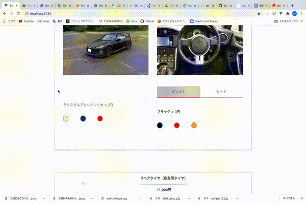

# CarEstimation  

## Overview  
車の見積もりアプリです。
グレードやオプションの選択によって購入金額が変動します。
## Description
スクールではRailsを使用してアプリを作成していましたが、新しいことに挑戦してみたくて  
Vue.jsでポートフォリオの作成に挑みました。  
## Demo  


## Installation  
```
$ git clone https://github.com/Belfraw/car_estimation.git
$ cd car_estimation
$ npm run serve
```
## Anything Else
ボディカラー選択の時ホワイトを選択するとオプション料金が発生するようにしています。  
シート、インパネのボタンを切り替えるとシートカラー、インパネカラーの画像が同じボタンで切り替えられるようになっています。

## task  
インパネからシートに切り替えると前の画像が残ったままなので
この部分を上手く切り替えられるようにしたいです。
一つのコンポーネントに機能まるごとつめこんでいるため
上手く複数のコンポーネントに分けられるようにしたい。
## Deploy
https://carestimation.herokuapp.com/
Windowsの環境下で正常に作動しないことがあります。
